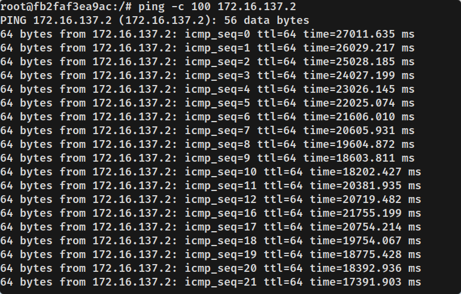
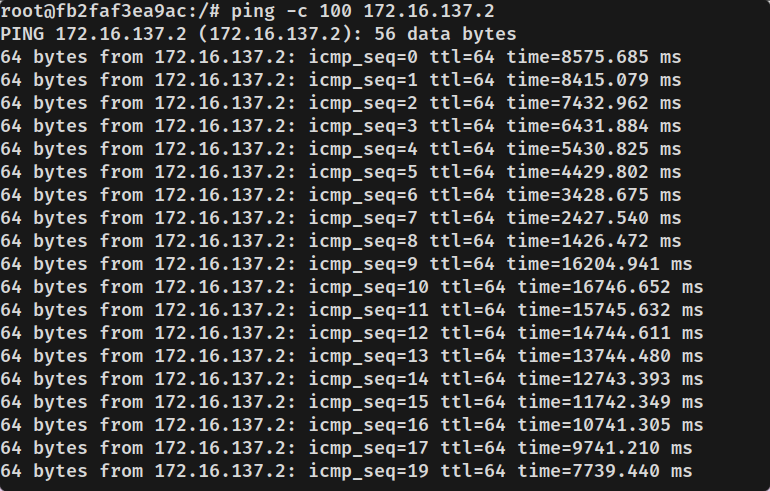

# osmocom network in docker container

as simple as `docker compose up`

common feautures:
- latest binary releases from osmocom repo
- configuration with single file `./configs/config.yml` (for most common parameters)
- automatic interaction with newly connected users
- egprs with routing
- active users monitoring and other useful scripts (see `./helpers`)

## limesdr configuration

In `./config/config.yml` set values in `radio` section:
```yml
...
radio:
  ...
  device-type: lime
  tx-path: BAND2
  rx-path: LNAW
  ...
```
BAND2 and LNAW do work on LimeSDR USB and LimeSDR Mini

## usrp b200/b210 configuration

In `./configs/config.yml` set values in `radio` section:
```yml
...
radio:
  ...
  device-type: uhd
  tx-path: TX/RX
  rx-path: TX/RX
  clock-ref: external
  ...
```
TX/RX and TX/RX should work, but need testing. You can also set external/internal/gpsdo clock-ref for usrp devices:
- external - ext 10 mhz ref clock, such as leo godnar/octoclock gpsdo
- internal - default usrp's clock
- gpsdo    - internal gpsdo that mounted in usrp board (if any)

Feel free to check offisial osmo-trx-uhd documentation, 1.10.4 clock-ref: https://ftp.osmocom.org/docs/osmo-trx/master/osmotrx-uhd-vty-reference.pdf

## usrp b200/b210 clones configuration

Place the custom firmware in `./configs/uhd_images/` and give it an appropriate name, such as usrp_b210_fpga.bin. It will be automatically placed in the `/usr/share/uhd/images/` folder inside the osmocom container. It's useful for devices such as USRP B210 LibreSDR clones.

In `./configs/config.yml` set values in `radio` section:
```yml
...
radio:
  ...
  device-type: uhd
  tx-path: TX/RX
  rx-path: TX/RX
  clock-ref: external
  ...
```
TX/RX and TX/RX do work on LibreSDR B220 mini (XC7A100T+AD9361). You can also set external/internal/gpsdo clock-ref for such devices:
- external - ext 10 mhz ref clock. Tested with leo bodnar gpsdo
- internal - default onboard clock, in my testbed it was too poor to get gsm work properly

## antsdr e200

This is not fully tested, but seems that network starts successfully, see https://github.com/godfuzz3r/osmo-nidc/issues/1

Switch to antsdr_e200 branch and rebuild containers with `docker compose build`.

In this branch uhd driver and osmo-trx compiled from source to get it work with antsdr hardware.

## gprs

DNS confirugration for default apn is in `./configs/dnsmasq/apn0.conf`

You can check who is currently using gprs with `./helpers/show-pdp.sh` or `./helpers/mon.sh`

You can also check the traffic on the apn0 interface with `./helpers/wireshark.sh`. This script will forward tcpdump output from container to wireshark.

### gprs network slow/not work

By default android/ios devices send large amount of traffic, which results in network degradation. You can work around this behavior by responding to any dns request with localhost. Just uncomment rules in `./configs/dnsmasq/apn0.conf`:
```
address=/#/127.0.0.1
address=/#/::1
```

Below are examples of ping timings with default DNS settings and DNS that responds with localhost to everything.

Default dns configuration, all mobile traffic goes through egprs:


Dns config resolves everything to localhost:


You can also enable/disable routing mobile traffic to the internet with `routing-enabled: true/false` in `./configs/config.yml` file:
```yaml
...
egprs:
  routing-enabled: true
  ...
```
This option will or will not setup iptables routing inside docker container.

## helpers

Here is bunch of scripts to analyze UE's behaviour or to interact with the network.

wireshark.sh - sniff on apn0 interface and show it in wireshark

send-*.sh - do manual interaction

show-pdp.sh - show current egprs usage

show-subscribers-msc.sh - show subscribers on msc

show-subscribers-hlr.sh - show subscribers on hlr

mon.sh - show currently online subscribers in table


## problems

- if MS leaves the network without detaching IMSI, it will be "active" for up to 8 minutes. This is because the minimum value for T3212 timer (location update) is 6 minutes, and MSC requires some time gap between T3212 value in BSC and MSC. Without gap, MSC may expire active subscribers.
- IPv6 routing not configured
- sometimes devices may be not properly "passed" to container. Stop container, reconnect device and start container again may help

## todo
- silent call/paging interaction
- setup default values if some fields in `./configs/config.yml` does not exists (for now deleting field from config.yml would cause crash)
- test/fix egprs with network_mode=host on antsdr_e200 branch